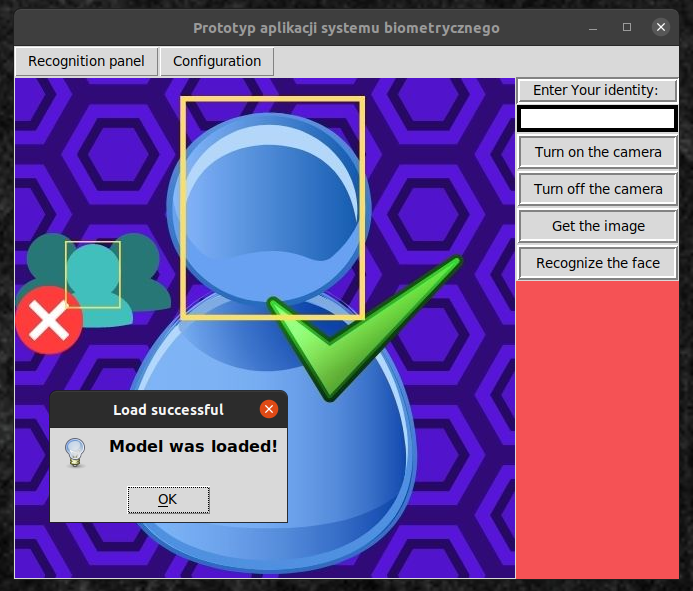
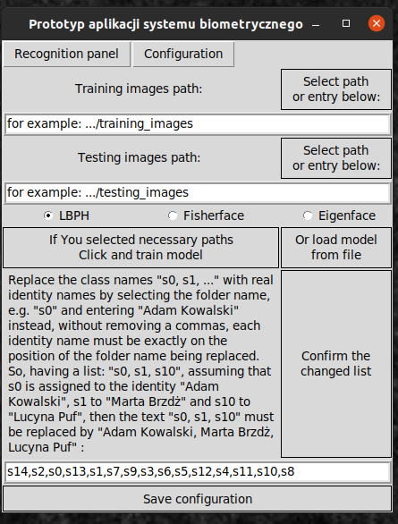

## Aplikacja okienkowa do rozpoznawania twarzy.

Pierw był to projekt na kurs z Systemów Wbudowanych i Mobilnych w Biomedycynie, ale już to sobie dalej sam naprawiam i rozwijam.
Usunąłem fragmenty pozostawione na pozostałe części systemu więc jest to aplikacja tylko do rozpoznawania twarzy.

### Funkcje:
- Rejestracja zdjęć:
	`zdjęcia zapisywane są w określonym folderze, z zadanym prefiksem, są one również zapisywane wraz z datą, podczas procesu weryfikacji`
- Szkolenie modelu rozpoznawania twarzy dla trzech podstawowych algorytmów zaimplementowanych w OpenCV
	`Model jest szkolony na podstawie zdjęć ze wskazanego folderu. Każda klasa nosi nazwę podfolderu ze zdjęciami konkretnej osoby, Prawdziwe nazwy tożsamości lub inne aliasy można podać w trakcie konfiguracji aplikacji, owa wartość będzie wtedy wymagana podczas procesu weryfikacji. Pliki modelu i jego dodatkowych parametrów zawierane są zawsze w określonym folderze`
- Detekcja przy pomocy klasyfikatora Haara (OpenCV) i rozpoznawanie:
	`Proces weryfikacji zakłada uchwycenie klatki z kamerki internetowej, stosowne przetworzenie obrazu i predykcji, owa jest ważna, o ile uzyskana odległość euklidesowa spełnia wymagania ustalone podczas procesu testowania modelu.`
- Możliwość załadowania modelu z zewnątrz / eksportu do dalszego użytku:
	`Wcześniej wyszkolony model można zastosować w aplikacji albo użyć jej tylko do stworzenia nowego modelu i zabrania pliku xml.`
- Wyszkolony model można przetestować w celu wygenerowania typowych odległości euklidesowych, chociażby po to, aby wykluczyć rozpoznanie kogokolwiek, bo przecież, kogoś musi wskazać. Twardy próg nie był zasadny.  

## okno główne:

## okno ustawień dla modelu rozpoznawania twarzy:

